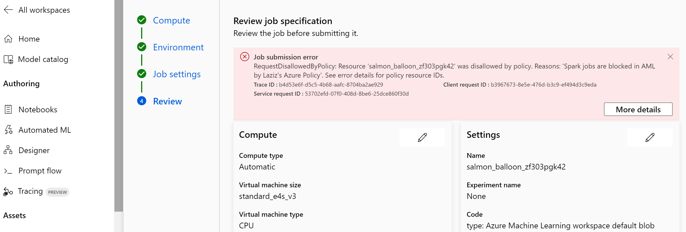

# Block Serverless Spark in Azure Machine Learning with Azure Policy
This brief guide will help you create an Azure Policy definition to block users from utilising Serverless Spark compute targets within Azure Machine Learning.

### Pre-requisites:
- An Azure subscription with appropriate permissions to create policies;
- Familiarity with setup of Azure Policies programmatically or in Azure portal UI.

### Configuration Steps:

1. Create policy definition file by copy-pasting the following JSON code or download provided [blockServerlessSpark.json](blockServerlessSpark.json) file:
``` JSON
{
    "if": {
        "allOf": [
            {
                "field": "Microsoft.MachineLearningServices/workspaces/jobs/jobType",
                "in": [
                    "Spark"
                ]
            }
        ]
    },
    "then": {
        "effect": "deny"
    }
}
```

> This policy checks for resources of type "Microsoft.MachineLearningServices/workspaces/jobs" with the property "jobType" set to "Spark". If it finds any (typically at the time of Serverless Spark job submission, it will trigger _**Deny**_ effect.

2. Create the Azure Policy definition.
 - You can do it programmatically as described in [Azure Policy documentation](https://learn.microsoft.com/en-us/azure/governance/policy/how-to/programmatically-create). Here's an example of using Azure CLI:
``` Bash
az policy definition create --name "block-serverless-spark-azureml" --display-name "Block the use of Serverless Spark in Azure ML" --description "This policy blocks the use of Serverless Spark in Azure ML" --rules <PATH TO JSON DEFINITION FILE, e.g. blockServerlessSpark.json> --mode All
```
- Alternatively, you can create new policy definition directly in Azure portal:


3. As a next step, you assign the policy and define its scope, i.e what to include and evaluate for copliance: You can refer to Microsoft documentation for details on [assigning policies](https://learn.microsoft.com/en-us/azure/governance/policy/concepts/assignment-structure).

4. To test the effect of newly created policy, try to create a new Serverless Spark job in Azure Machine Learning workspace. The policy should deny the creation as shown on example below:


> Note: This is a basic policy example. You can customise it further based on your needs.
